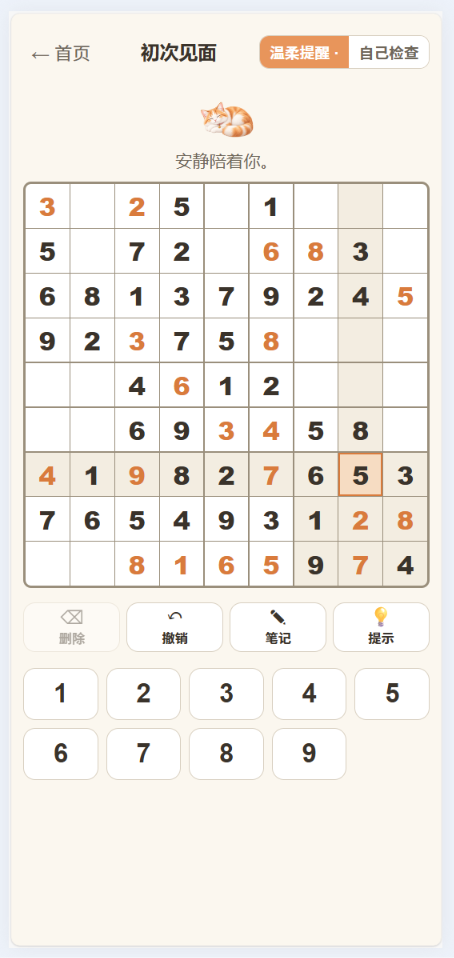
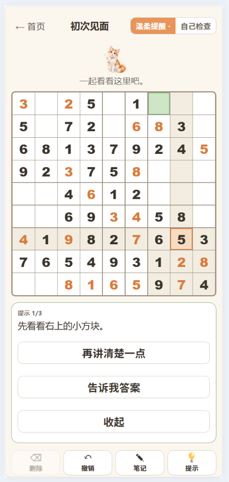

# 🐱 Neko Sudoku · 猫咪数独

一个轻松、安静、没有压力的数独小游戏。

Neko Sudoku 面向喜欢慢慢思考的玩家设计，不强调速度、分数或排名，也不会因为填错几次就结束游戏。猫咪会在游戏过程中陪着你，在需要的时候给一点提示。

## 在线体验

https://shouheitiger.github.io/neko-sudoku-web/

## 项目截图

<p align="center">
  
  
</p>

<p align="center">
  游戏界面 · 三层渐进式提示
</p>

## 主要功能

- 4 个难度等级
  - 初次见面 · 入门
  - 轻松一下 · 简单
  - 动动脑筋 · 普通
  - 专心一下 · 中等

- 1200 道经过唯一解验证的数独题目
- 支持数字输入、删除、撤销和候选数字笔记
- 三层渐进式提示
  - 先提示观察方向
  - 再解释解题思路
  - 需要时告诉你下一步怎么填

- 两种错误提醒方式
  - 温柔提醒：填错时轻轻提醒，不记录错误次数
  - 自己检查：像纸上数独一样，不主动判断答案对错

- 自动保存未完成的一局
  - 游戏进度保存在当前浏览器本地
  - 刷新或重新打开页面后可以继续
  - 不需要注册账号

- 历史记录
- 大字体模式
- 新手教程
- 完整玩法帮助
- 猫咪陪伴状态
- 支持手机和桌面浏览器
- 支持 Reduced Motion

## 设计理念

Neko Sudoku 不追求竞技感。

没有排行榜，没有实时倒计时，也没有“错误次数用完”之类的惩罚机制。

希望它更像一个可以随手打开、安静玩一会儿的数独应用。

> 不用赶时间，也不用怕填错。慢慢想，也很好。

## 技术栈

- React
- TypeScript
- Vite
- React Router
- Zustand
- Zod
- Vitest
- Playwright
- GitHub Pages

## 数据与隐私

Neko Sudoku 是纯前端应用。

当前版本没有账号系统，也没有云端保存游戏进度。未完成游戏、设置和历史记录主要保存在用户自己的浏览器 `localStorage` 中。

因此：

- 更换设备不会自动同步进度
- 更换浏览器不会自动同步进度
- 清除浏览器网站数据后，本地记录可能丢失

## 开源

项目源码已公开，欢迎查看、学习和交流。

如果发现问题或有建议，欢迎通过 GitHub Issues 提交反馈。

## 开源许可

本项目采用 [MIT License](LICENSE) 开源。

你可以使用、复制、修改和分发本项目，也可以用于商业用途，但需按照 MIT License 的要求保留原版权声明和许可声明。

完整条款请参阅 [LICENSE](LICENSE)。

---

# 🐱 Neko Sudoku

A calm, low-pressure Sudoku game designed for people who enjoy taking their time.

Neko Sudoku does not focus on speed, scores, rankings, or punishing mistakes. The goal is simple: solve Sudoku at your own pace, with a friendly cat companion along the way.

## Play Online

https://shouheitiger.github.io/neko-sudoku-web/

## Features

- 4 difficulty levels
  - First Meeting · Beginner
  - Take It Easy · Easy
  - Think a Little · Normal
  - Focus Time · Medium

- 1,200 Sudoku puzzles with verified unique solutions
- Number input, delete, undo, and candidate notes
- Three-stage hint system
  - First, a gentle clue about where to look
  - Then, an explanation of the logic
  - If needed, guidance on what to enter next

- Two mistake-checking modes
  - Gentle Reminder: softly alerts you when an entry is incorrect, without counting mistakes
  - Check It Yourself: keeps your entries without immediately judging whether they are correct

- Automatic local save
  - Your unfinished game is saved in your current browser
  - Refresh the page or come back later and continue where you left off
  - No account required

- Game history
- Large Text mode
- Beginner tutorial
- Detailed Help page
- Cat companion states
- Mobile and desktop browser support
- Reduced Motion support

## Design Philosophy

Neko Sudoku is not designed as a competitive Sudoku app.

There are no leaderboards, no visible countdown timer, and no “too many mistakes” game-over system.

It is meant to feel more like a quiet little game you can open whenever you want to think for a while.

> No need to rush. No need to worry about mistakes. Take your time.

## Tech Stack

- React
- TypeScript
- Vite
- React Router
- Zustand
- Zod
- Vitest
- Playwright
- GitHub Pages

## Data and Privacy

Neko Sudoku is a fully client-side web application.

The current version has no account system and no cloud save. Unfinished games, settings, and history are stored mainly in your own browser using `localStorage`.

This means progress does not automatically sync across devices or browsers, and clearing browser site data may remove locally stored progress.

## Open Source

The source code is public for learning, discussion, and improvement.

If you find a bug or have a suggestion, feel free to open a GitHub Issue.

## License

This project is licensed under the [MIT License](LICENSE).

You are free to use, copy, modify, distribute, and commercially use the project subject to the terms of the MIT License.

See [LICENSE](LICENSE) for the full license text.

---

## 本地开发 · Local Development

```bash
# 安装依赖 / install dependencies
npm ci

# 启动开发服务器 / start the dev server
npm run dev

# 生产构建 / production build
npm run build

# 本地预览构建产物 / preview the production build
npm run preview
```

### 常用脚本 · npm scripts

| 脚本 / script        | 说明 / description                                        |
| -------------------- | --------------------------------------------------------- |
| `npm run dev`        | 本地开发服务器 / dev server                               |
| `npm run build`      | 生产构建 / production build                               |
| `npm run preview`    | 预览构建产物 / preview the build                          |
| `npm test`           | 单元测试（Vitest）/ unit tests                            |
| `npm run e2e`        | 端到端测试（Playwright）/ end-to-end tests                |
| `npm run typecheck`  | TypeScript 类型检查 / type check                          |
| `npm run release:check` | 发布前检查（类型 + 单测 + 构建）/ pre-release checks   |

> 说明：`build:pages` / `test:pages` / `e2e:pages` 为 GitHub Pages 部署环境下的对应变体。
